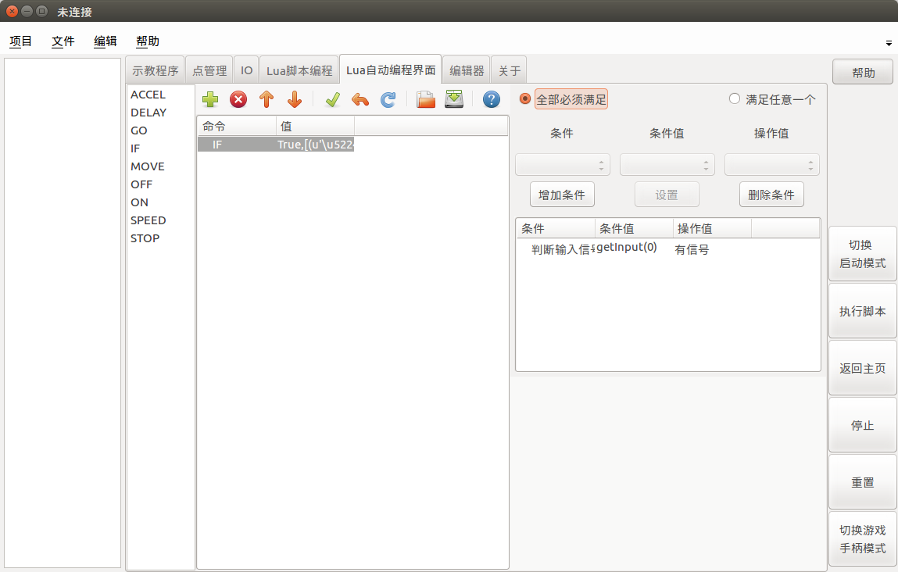
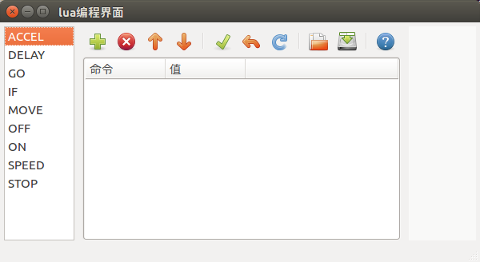

.. raw:: html

    

.. _getting_started:

***************
Lua自动编程界面介绍
***************

.. _installing-docdir:

目录结构
=============================
目录结构打印::

    ├── build               编译html文件的生成文件
    ├── config.py           自动生成docs的配置文件
    ├── demos               应用Lua自动编程界面的demos(重要)
    ├── dependencies        依赖
    ├── __init__.py
    ├── __init__.pyc
    ├── Main.py             主程序入口文件
    ├── Main.pyc
    ├── make.bat
    ├── Makefile            编译html文件的MakeFile
    ├── README.md
    ├── source              编译html文件的源文件
    ├── src                 已发布版本的文件目录
    └── test                测试开发版本的文件目录(重要)

.. _important_dir:

重要文件目录
=============================

+-------+-----------------------------------------------------------------+
| 目录  | 说明                                                            |
+-------+-----------------------------------------------------------------+
| demos | 包含底层自动转出代码的引擎及对Commands重写的文件                |
+-------+-----------------------------------------------------------------+
| test  | 包含所有自动Lua编程GUI的逻辑代码及调用demos中的引擎写命令的逻辑 |
+-------+-----------------------------------------------------------------+

.. _realization_result:

实现效果
=============================

集成在主界面作为自动编程功能
-----------------------------

独立实现的效果
-----------------------------

.. _execution_principle:

运行模型
=============================

#. 简单模型

#. 功能间调用关系模型

#. 分功能模型

.. _simple_model:

简单模型
----------------------------

简单的来讲， 软件模型是典型的MVC结构。
通过publisher机制对界面数据与底层数据之间的交互进行解耦，统一由Controller进行管理。

.. _link_relationship_between_functions:

功能间调用关系模型
----------------------------
.. raw:: html

   

   
   Inheritance diagram for class <strong>AcceleratorEntry</strong>:
   

   

   

   

   

   

   
   <map id="dummy" name="dummy"> <area shape="rect" id="node1" href="wx.AcceleratorEntry.html" title="An object used by an application wishing to create an accelerator table (see wx.AcceleratorTable)." alt="" coords="5,5,153,35"/> </map>
   

xaasas

.. attention::

   Please attentio

.. automodule:: control.control_function_list.control_function
    :members:

